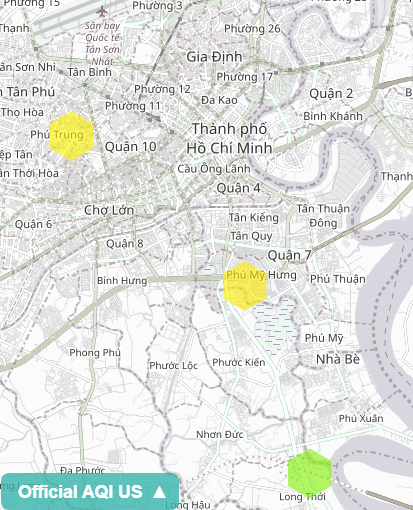

# AQI global

We build a AQI sensor for PM 2.5 and PM 10 with a ESP8266 following the instructions on https://luftdaten.info/en/home-en/ and connected a 1602 display to the unit to show the measurements. 

## Cloud

The data is uploaded to the cloud each 145 seconds to https://maps.luftdaten.info 

Look at the map of Ho Chi Minh: https://maps.luftdaten.info/#12/10.7422/106.7044

## Indoor sensor 8808591

(picture follows) of our indoor sensor with display for the students ...

PM2.5 and PM10 https://www.madavi.de/sensor/graph.php?sensor=esp8266-8808591-sds011 
Humidity and Temperature: https://www.madavi.de/sensor/graph.php?sensor=esp8266-8808591-dht 

## Outdoor sensor 

This is the sensor outdoor: 

PM2.5 and PM10 https://www.madavi.de/sensor/graph.php?sensor=esp8266-12779556-sds011 
Humidity and Temperature: https://www.madavi.de/sensor/graph.php?sensor=esp8266-12779556-dht 

